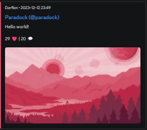

# darflen.xyz
embed proxy for [Darflen](https://darflen.com), built on [darflen.ts](https://github.com/czctus/darflen.ts) using Hono and deployed on Cloudflare Workers.



## disclaimer
> [!WARNING]
> this project is not affiliated with, nor endorsed by, darflen or its developers. it's an independent project.

## supported endpoints
- posts:
    - `/posts/:id`
- users:
    - `/users/:username` (or `/users/$:username`) <!-- the `$` symbol is intentional; it's how the darflen api differentiates between username and id -->
    - `/users/:username/pfp` (or `/users/$:username/pfp`)
    - `/users/:username/banner` (or `/users/$:username/banner`)

## usage (as a user)
1. copy a `darflen.com` url
2. replace `.com` with `.xyz`
3. send the url on a platform (such as discord) that supports embedding
4. the embed should render as expected

## usage (as a developer)

### prerequisites
- [Node.js](https://nodejs.org/en)
- [pnpm](https://pnpm.io/installation) (or another package manager, but the instructions below are for pnpm)

### setup and running
```bash
git clone https://github.com/czctus/darflen.xyz # clone the repo
cd darflen.xyz # navigate to the project directory
pnpm i # install dependencies
pnpm dev # start the development server
```

### remarks
- you do not need darflen api keys to run this project, as it only uses public endpoints of the darflen API
- the project is built using Hono, a web framework for Cloudflare Workers, and darflen.ts, a TypeScript wrapper for the darflen API
- you can add the `?raw` query parameter to any endpoint to avoid being redirected

## license
[MIT](LICENSE)